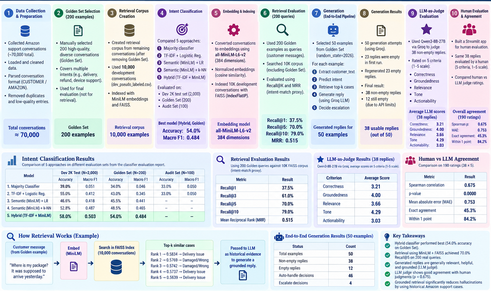

# SupportIQ

**An evidence-grounded AI customer support agent**, built and evaluated end-to-end on ~70,000 real Amazon customer-support conversations (Twitter): intent classification → historical case retrieval → grounded reply generation → escalation policy — with every stage benchmarked against a 200-example human-labeled Golden Set.

```bash
streamlit run app.py
```

---

## Table of Contents

- [Overview](#overview)
- [Architecture](#architecture)
- [Quickstart](#quickstart)
- [Repository Structure](#repository-structure)
- [Data & Intent Taxonomy](#data--intent-taxonomy)
- [Results](#results)
  - [1. Intent Classification](#1-intent-classification)
  - [2. Retrieval Quality](#2-retrieval-quality)
  - [3. End-to-End Generation](#3-end-to-end-generation)
  - [4. LLM-as-Judge Evaluation](#4-llm-as-judge-evaluation)
  - [5. Human vs. LLM Agreement](#5-human-vs-llm-agreement)
- [Key Findings](#key-findings)
- [Limitations](#limitations)
- [Known Issues / Roadmap](#known-issues--roadmap)

---

## Overview

SupportIQ takes a raw customer message ("*My package hasn't arrived yet.*") and produces a complete, auditable support decision:

1. **Classifies** the customer's intent (one of 11 categories)
2. **Retrieves** the most similar historical Amazon support cases via semantic search
3. **Decides** whether to auto-handle the case or escalate it to a human
4. **Generates** a reply that is grounded *only* in the retrieved evidence — never inventing policies, refunds, or links

Every stage was built independently, measured against held-out and human-labeled data, and only wired into a single runnable pipeline once each piece's performance was understood in isolation. That evaluation trail is what the [Results](#results) section below reports.

## Architecture



The diagram above covers the full build & evaluation pipeline (data → golden set → retrieval corpus → classifier → embeddings/index → retrieval eval → generation → LLM-judge → human eval). The **runtime** path that actually answers a customer message at demo time is the subset of that pipeline wired into `SupportIQAgent`:

```text
Customer message
       │
       ▼
┌─────────────────────┐
│  Intent Classifier   │   Hybrid: TF-IDF + MiniLM embeddings → Logistic Regression
│  (src/pipeline/       │   54.0% accuracy / 0.484 macro F1 on the 200-example Golden Set
│   classifier.py)      │
└─────────┬────────────┘
          │ intent + confidence
          ▼
┌─────────────────────┐
│   Case Retriever      │   MiniLM embeddings + FAISS (IndexFlatIP, cosine sim)
│  (src/pipeline/        │   over the 10,000-conversation corpus
│   retriever.py)        │   Recall@5 = 70.0%, MRR = 0.515
└─────────┬────────────┘
          │ top-k historical cases
          ▼
┌─────────────────────┐
│  Escalation Policy     │   Rule-based gate: high-risk keywords, explicit human
│  (src/pipeline/        │   request, or low retrieval similarity (< 0.50) → ESCALATE
│   escalation.py)       │
└─────────┬────────────┘
          │
          ▼
┌─────────────────────┐
│  Reply Generator       │   Groq LLM, strictly grounded in the retrieved evidence -
│  (src/pipeline/        │   forbidden from inventing policies, links, or actions
│   generator.py)        │
└─────────┬────────────┘
          │
          ▼
   Final agent response
   (intent, evidence, reply, escalation decision)
```

All four stages are orchestrated by [`src/pipeline/agent.py`](src/pipeline/agent.py) (`SupportIQAgent.run()`), and rendered by [`app.py`](app.py).

## Quickstart

The repository already includes the trained classifier and FAISS retrieval artifacts under `models/` (they're committed to git, not gitignored), so a fresh clone can run the demo directly — no source dataset or model-building step required.

### 1. Install dependencies

```bash
pip install -r requirements.txt
```

### 2. Add your Groq API key

```bash
cp .env.example .env
# then edit .env and set:
GROQ_API_KEY=...
```

### 3. Run the demo

```bash
streamlit run app.py
```

That's it — `models/` already contains everything the app needs to start instantly:

```text
models/
├── classifier.pkl        # fitted TF-IDF vectorizer + Hybrid Logistic Regression classifier
├── faiss_index.bin       # FAISS index over the 10K retrieval corpus
└── corpus_metadata.csv   # row-aligned conversations + intents (FAISS row i ↔ metadata row i)
```

### Rebuilding artifacts (optional)

You only need this if you want to rebuild the artifacts from the 10K development corpus yourself — for example, after changing labels or retraining the classifier:

```bash
python tools/build_artifacts.py
```

This takes a few minutes on CPU (mostly spent embedding 10,000 conversations with MiniLM), overwrites `models/*`, and requires `data/processed/dev_pseudo_labeled.csv` to exist locally — that file is gitignored (along with `data/raw/` and `.env`), so it won't be present after a fresh clone unless you regenerate it via notebooks 01–04 or otherwise supply it yourself.

## Repository Structure

```text
.
├── app.py                          # Streamlit demo — the evaluator-facing entry point
├── requirements.txt
├── models/                         # Built artifacts (classifier + FAISS index), see Quickstart
│
├── src/pipeline/                   # The actual runtime agent
│   ├── agent.py                    #   SupportIQAgent — orchestrates all 4 stages
│   ├── classifier.py               #   Hybrid TF-IDF + MiniLM intent classifier
│   ├── retriever.py                #   MiniLM + FAISS historical case retrieval
│   ├── generator.py                #   Groq-backed grounded reply generation
│   └── escalation.py               #   Rule-based auto-handle / escalate policy
│
├── tools/
│   ├── build_artifacts.py          # Builds models/* (run this once before the demo)
│   └── evaluate_baselines_final.py # Standalone baseline comparison script
│
├── notebooks/                      # The full build & evaluation trail, in order:
│   ├── 01_dataset_exploration.ipynb
│   ├── 02_thread_reconstruction.ipynb
│   ├── 03_intent_discovery.ipynb
│   ├── 04_pseudo_label_analysis.ipynb
│   ├── 05_classifier_evaluation.ipynb   # trains & compares all 5 classifier approaches
│   └── 06_retrieval_evaluation.ipynb    # builds FAISS index, generation, escalation, evals
│
├── evaluation/
│   ├── human_eval_app.py           # Streamlit app for blind human reply evaluation
│   ├── human_judge.csv             # 38 replies × 5 criteria, human-rated
│   └── reply_judge_results.csv     # same 38 replies, LLM-judge-rated
│
├── results/                        # All reported metrics & reports (see Results below)
│   ├── classifier_evaluation_report.md
│   ├── final_model_comparison.csv
│   ├── retrieval_metrics.json
│   └── top_5_failure_modes.md
│
├── data/
│   ├── golden/                     # 200-example Golden Set + 100-example Audit Set (tracked)
│   ├── raw/                        # Source dataset (gitignored)
│   └── processed/                  # 10K pseudo-labeled dev corpus (gitignored)
│
└── docs/
    ├── taxonomy.md                 # The 11-intent taxonomy + annotation rules
    └── images/architecture.png
```

## Data & Intent Taxonomy

- **Source:** ~70,000 real Amazon customer-support conversations reconstructed from the "Customer Support on Twitter" dataset.
- **Golden Set (200 examples):** manually selected and human-labeled, held out from all training — the primary evaluation benchmark throughout this project.
- **Dev set (10,000 examples):** the pseudo-labeled/reviewed development pool used to train the classifier and as the retrieval corpus. As of the last labeling pass, 2,329 of these 10,000 rows have been manually re-labeled by genuine human review (replacing the original heuristic pseudo-labels); the remainder retain heuristic labels.
- **Audit Set (100 examples):** a smaller, separately human-reviewed validation set.

Every conversation is classified into exactly one of **11 intents** — see [`docs/taxonomy.md`](docs/taxonomy.md) for the full definitions and annotation rules:

`Delivery Issue` · `Damaged / Wrong / Missing Item` · `Order Management` · `Return / Refund` · `Payment / Billing` · `Account / Access / Security` · `Prime Membership` · `Digital Content` · `Product / Device Support` · `Promotion / Gift Card / Credit` · `Other / Unclear`

## Results

Full detail lives in [`results/classifier_evaluation_report.md`](results/classifier_evaluation_report.md). Headline numbers below.

### 1. Intent Classification

Five approaches were trained and compared on the same 8K/10K split, evaluated against the Golden Set (primary benchmark), the held-out 2K dev split, and the Audit Set:

| Model | Golden Set Accuracy | Golden Set Macro F1 | Dev 2K Accuracy | Dev 2K Macro F1 |
|---|---:|---:|---:|---:|
| Majority Classifier | 34.0% | 0.046 | 39.0% | 0.051 |
| TF-IDF + Logistic Regression | 43.0% | 0.345 | 55.0% | 0.412 |
| Semantic (MiniLM) + Logistic Regression | 45.5% | 0.441 | 46.6% | 0.418 |
| Semantic (MiniLM) + k-NN | 38.0% | 0.198 | 27.5% | 0.083 |
| **Hybrid (TF-IDF + MiniLM) + Logistic Regression** | **54.0%** | **0.484** | 53.4% | 0.435 |

The **Hybrid classifier** (33,045 combined features: 32,661 TF-IDF + 384 MiniLM) is the one wired into the runtime agent — it's the strongest performer on the human-labeled Golden Set, the metric this project treats as authoritative (the 2K dev benchmark is partly self-referential, since it shares label provenance with the training data).

**Recurring error patterns** (full detail in [`results/top_5_failure_modes.md`](results/top_5_failure_modes.md)):
- Delivery-related messages confused with `Other / Unclear` when the delivery language is ambiguous.
- Shipment problems vs. item problems ("package arrived, but the item is wrong") pull toward `Delivery Issue`.
- The word "order" appearing across many intents drags predictions toward `Order Management`.
- Rare intents (`Prime Membership`: 16 training examples, `Promotion / Gift Card / Credit`: 40) are the weakest classes in every model — a data sparsity problem, not a modeling one.

### 2. Retrieval Quality

MiniLM (`all-MiniLM-L6-v2`) embeddings + FAISS flat inner-product search over the 10K corpus, evaluated on 200 Golden Set queries against a leakage-safe corpus (Golden Set excluded), using intent-match as a relevance proxy:

| Metric | Result |
|---|---:|
| Recall@1 | 37.5% |
| Recall@3 | 61.0% |
| Recall@5 | 70.0% |
| Recall@10 | 79.0% |
| Mean Reciprocal Rank (MRR) | 0.515 |

### 3. End-to-End Generation

Running the full pipeline (classify → retrieve → generate → escalate) on 50 Golden Set examples via Groq:

| Metric | Count |
|---|---:|
| Total examples | 50 |
| Non-empty replies | 38 |
| Empty replies (API limits during generation) | 12 |
| Auto-handle decisions | 46 |
| Escalate decisions | 4 |

### 4. LLM-as-Judge Evaluation

The 38 non-empty replies were scored by an LLM judge (Qwen3-8B-27B via Groq) on 5 criteria, 1–5 scale:

| Criterion | Average Score |
|---|---:|
| Correctness | 3.21 |
| Groundedness | 4.00 |
| Relevance | 3.66 |
| Tone | 4.29 |
| Actionability | 3.03 |

### 5. Human vs. LLM Agreement

The same 38 replies were independently rated by a human across the same 5 criteria (see [`evaluation/human_judge.csv`](evaluation/human_judge.csv)), then compared against the LLM judge (190 rating pairs total):

| Criterion | Spearman ρ | p-value | MAE | Exact Agreement | Within 1 Point |
|---|---:|---:|---:|---:|---:|
| Correctness | 0.792 | <0.001 | 0.632 | 50.0% | 89.5% |
| Groundedness | 0.492 | 0.002 | 1.211 | 34.2% | 63.2% |
| Relevance | 0.683 | <0.001 | 0.711 | 42.1% | 89.5% |
| Tone | 0.643 | <0.001 | 0.658 | 42.1% | 92.1% |
| Actionability | 0.803 | <0.001 | 0.553 | 57.9% | 86.8% |
| **Average** | **0.683** | — | **0.753** | **45.3%** | **84.2%** |

The human rater's independent pass through all 38 replies also surfaced a concrete bug that the LLM-judge scores alone didn't make obvious: **13 of the 38 generated replies were truncated mid-sentence or mid-URL** (the `max_tokens=300` cap in [`generator.py`](src/pipeline/generator.py) cutting responses off before completion). This is the leading cause of the low Actionability scores from both raters and is flagged as the top item in [Known Issues](#known-issues--roadmap).

## Key Findings

1. **A trivial baseline is insufficient** — majority-class prediction reaches only 34.0% Golden Set accuracy (0.046 macro F1); the task genuinely requires distinguishing 11 classes.
2. **Lexical and semantic features are complementary, not redundant** — combining TF-IDF with MiniLM embeddings (54.0%) beats either alone (43.0% / 45.5%), a full 11-point jump over TF-IDF alone.
3. **Retrieval provides useful intent-level evidence coverage** — 70% of the 200 Golden Set queries had at least one same-intent historical case in the top 5 retrieved results.
4. **The LLM judge is a reasonable, imperfect proxy for human judgment** — strong correlation on Correctness/Actionability (ρ > 0.79), weaker on Groundedness (ρ = 0.49), where the judge appears more lenient than a human reading the same evidence side-by-side with the reply.
5. **Generation reliability, not intent accuracy, is currently the biggest gap** — the reply-truncation bug affects over a third of sampled outputs and is a bigger practical risk to the demo than any classifier accuracy number.

## Limitations

- The Golden Set (200 examples) and Audit Set (100 examples) are both small; several intents have limited support within them.
- The 10K dev/training corpus is a mix of manually-reviewed and heuristic pseudo-labels at any given point in time — see the label-provenance note in `results/classifier_evaluation_report.md`.
- The dataset is historical Twitter customer-support data and may not reflect current support traffic patterns or channels.
- The classifier assigns exactly one intent per conversation, even when multiple issues are present.
- A correct intent prediction does not guarantee a correct or safe generated reply — classification, retrieval, and generation quality were evaluated independently, not as a guarantee of joint correctness.

## Known Issues / Roadmap

- **Reply truncation** (`src/pipeline/generator.py`, `max_tokens=300`): causes ~1/3 of generated replies to cut off mid-sentence. Raising this limit is a likely quick fix, left unchanged so far to preserve exact parity with the notebook's reported behavior.
- **Data files are gitignored** (`data/raw/`, `data/processed/`): `tools/build_artifacts.py` requires `data/processed/dev_pseudo_labeled.csv` locally. The committed `models/*` artifacts are what actually make the demo portable — a fresh clone needs those (or the raw data + a rerun of notebooks 01–04) to reproduce them from scratch.
- **Retrieval evidence vs. classifier input mismatch**: the classifier is trained on customer-only text, while the retrieval corpus embeds full conversations (including Amazon's replies) — intentional per the original notebooks, but worth revisiting if retrieval precision needs improvement.
